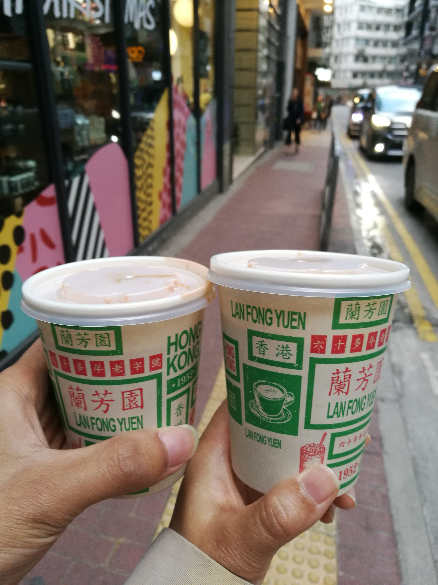

# 关于2018/12/19晚间争吵的思考

12月19日晚间做饭期间因一点小事跟老婆起了争执，如果处理得当，本该迅速解决，但因为自己的一系列错误做法，使事态扩大化，几近失控，消耗双方的精力，影响双方的感情，实在是不应该，为避免类似事件的再次发生，经过深刻的反思，总结如下：

1.瓶盖没有拧紧，我几乎不假思索的认为是她的失误，这本身是一件小事，但暴露出来的深层次问题是我没有任何的依据，就将事故起因归结于他人，这是非常不对的，这一点以后要改正。

2.老婆因此事闹脾气，我不应该用更大的脾气来回应，这种做法只会让事态扩大，正确的做法应该是耐心的哄老婆，直到哄好为止，态度应和蔼，语气宜轻柔，内心要真诚。

3.在出现矛盾时，应以及时沟通为要，20号晚间的僵持状态以后要避免，要相信没有沟通解决不了的问题。

4.在争吵期间，我的态度有点凶，这是非常不对的，在任何时间任何地点任何情况下都不能凶老婆，要用心呵护，把她捧在手心上，这是作为老公的责任。

